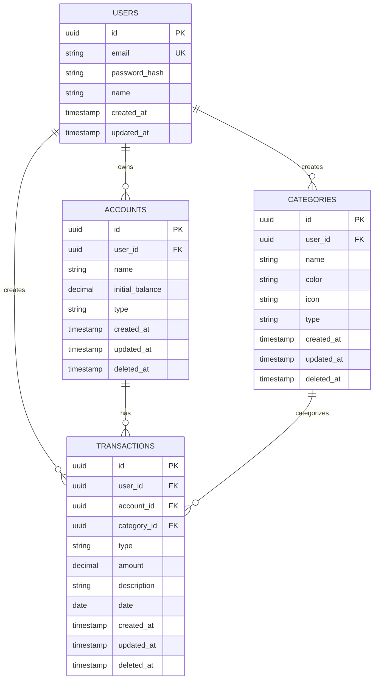

# 📋 DOCUMENTO 1: DEFINIÇÃO DE ESCOPO E ARQUITETURA DE PROJETOS

## 📚 SUMÁRIO

1. [Introdução](#introdução)
2. [O que é Escopo de Projeto](#o-que-é-escopo-de-projeto)
3. [Metodologia de Definição de Escopo](#metodologia-de-definição-de-escopo)
4. [Arquitetura de Software](#arquitetura-de-software)
5. [Planejamento Técnico](#planejamento-técnico)
6. [FinTrack: Aplicação Prática](#fintrack-aplicação-prática)
7. [Decisões Arquiteturais](#decisões-arquiteturais)
8. [Roadmap de Desenvolvimento](#roadmap-de-desenvolvimento)

---

## 🎯 INTRODUÇÃO

Este documento tem como objetivo ensinar **como pensar e arquitetar um projeto de software do zero**, abordando desde a definição de escopo até decisões arquiteturais profundas.

### Por que esse documento existe?

A maioria dos desenvolvedores aprende a **programar**, mas não aprende a:
- ✅ **Planejar** um projeto completo
- ✅ **Definir escopo** de forma realista
- ✅ **Arquitetar** soluções escaláveis
- ✅ **Tomar decisões** técnicas fundamentadas
- ✅ **Evoluir** software de forma sustentável

Este documento preenche essa lacuna.

---

## 📦 O QUE É ESCOPO DE PROJETO

### Definição

**Escopo** é o conjunto de:
1. **Funcionalidades** que o sistema deve ter
2. **Requisitos** técnicos e de negócio
3. **Limitações** e restrições
4. **Objetivos** e metas claras
5. **Não-objetivos** (o que NÃO vamos fazer)

### Por que definir escopo é crítico?

```
SEM ESCOPO               →  COM ESCOPO
├─ Projeto sem fim       →  ├─ Prazos realistas
├─ Features infinitas    →  ├─ Priorização clara
├─ Código desorganizado  →  ├─ Arquitetura coerente
├─ Burnout              →  ├─ Progresso mensurável
└─ Projeto abandonado    →  └─ Entrega de valor
```

### Os 3 Pilares do Escopo

#### 1️⃣ Clareza de Propósito

**Pergunta-chave**: *Por que este projeto existe?*

**Exemplo FinTrack**:
```
❌ Ruim: "Vou fazer um app de finanças"
✅ Bom:  "Vou criar um sistema para controlar receitas/despesas,
         permitindo categorização, visualização de saldo e
         relatórios mensais para pessoas físicas"
```

#### 2️⃣ Delimitação de Funcionalidades

**Pergunta-chave**: *O que o sistema FAZ e o que NÃO FAZ?*

**Exemplo FinTrack**:
```
✅ FAZ:
   - Cadastro de transações (receitas/despesas)
   - Categorização
   - Saldo consolidado
   - Relatórios mensais
   - Autenticação

❌ NÃO FAZ (pelo menos na V1):
   - Integração bancária automática
   - Investimentos
   - Multi-moeda
   - Multi-usuário (empresas)
   - App mobile nativo
```

#### 3️⃣ Restrições e Contexto

**Pergunta-chave**: *Quais são as limitações?*

```
Técnicas:
├─ Stack definida (TypeScript + React + PostgreSQL)
├─ Monolito (não microsserviços)
└─ Self-hosted (não SaaS)

Tempo:
├─ 18 semanas totais
└─ 4 fases incrementais

Conhecimento:
├─ Projeto de aprendizado
└─ Evolução progressiva
```

---

## 🧭 METODOLOGIA DE DEFINIÇÃO DE ESCOPO

### Passo 1: Identificar o Problema Real

**Técnica**: 5 Whys (5 Porquês)

```
Problema: "Não sei onde meu dinheiro vai"
├─ Por quê? → "Não anoto meus gastos"
├─ Por quê? → "Apps existentes são complexos demais"
├─ Por quê? → "Têm features que não preciso"
├─ Por quê? → "São voltados para investidores"
└─ Solução: App simples focado em transações básicas
```

### Passo 2: Definir Personas

**FinTrack - Persona Principal**:

```
Nome: Maria, 28 anos
Profissão: Designer
Objetivo: Controlar gastos mensais
Dores:
├─ Não sabe quanto gasta por categoria
├─ Esquece de anotar despesas pequenas
└─ Quer ver saldo consolidado

Necessidades:
├─ Cadastro rápido de transações
├─ Categorização simples
└─ Dashboard visual
```

### Passo 3: User Stories

**Formato**: Como [persona], eu quero [ação] para [benefício]

```
US-01: Como usuário, quero me cadastrar para ter acesso ao sistema
US-02: Como usuário, quero fazer login para acessar minhas finanças
US-03: Como usuário, quero cadastrar uma despesa para registrar um gasto
US-04: Como usuário, quero cadastrar uma receita para registrar uma entrada
US-05: Como usuário, quero categorizar transações para organizar meus gastos
US-06: Como usuário, quero ver meu saldo atual para saber quanto tenho
US-07: Como usuário, quero listar transações por período para analisar gastos
US-08: Como usuário, quero editar transações para corrigir erros
US-09: Como usuário, quero excluir transações para remover registros inválidos
US-10: Como usuário, quero ver relatório mensal para entender meu padrão de gastos
```

### Passo 4: Priorização (MoSCoW)

```
MUST HAVE (Tem que ter):
├─ Autenticação
├─ CRUD de transações
├─ Categorização
├─ Saldo consolidado
└─ Lista com filtros

SHOULD HAVE (Deveria ter):
├─ Relatórios mensais
├─ Dashboard com gráficos
├─ Paginação
└─ Soft delete

COULD HAVE (Poderia ter):
├─ Parcelamento
├─ Metas financeiras
└─ Exportação CSV

WON'T HAVE (Não terá agora):
├─ Integração bancária
├─ App mobile
└─ Multi-moeda
```

### Passo 5: Definir Requisitos

#### Requisitos Funcionais (RF)

```
RF-01: O sistema deve permitir cadastro de usuários
RF-02: O sistema deve autenticar usuários com email e senha
RF-03: O sistema deve permitir CRUD de transações
RF-04: O sistema deve categorizar transações
RF-05: O sistema deve calcular saldo consolidado
RF-06: O sistema deve filtrar transações por data
RF-07: O sistema deve paginar listagens
RF-08: O sistema deve fazer soft delete de registros
RF-09: O sistema deve gerar relatórios mensais
RF-10: O sistema deve validar dados de entrada
```

#### Requisitos Não-Funcionais (RNF)

```
RNF-01: Segurança
├─ Senhas devem ser hasheadas com bcrypt
├─ JWT para autenticação
├─ Proteção contra XSS e CSRF
└─ Rate limiting

RNF-02: Performance
├─ Listagens paginadas
├─ Índices em colunas de busca
├─ Queries otimizadas
└─ Cache (fase avançada)

RNF-03: Usabilidade
├─ Interface responsiva
├─ Feedback visual (loading/error)
├─ Formulários validados
└─ Mensagens claras

RNF-04: Manutenibilidade
├─ Código limpo
├─ Separação de camadas
├─ Testes automatizados
└─ Documentação

RNF-05: Escalabilidade
├─ Arquitetura preparada para crescer
├─ Paginação por cursor (fase 2)
└─ Processamento assíncrono (fase 3)
```

---

## 🏗 ARQUITETURA DE SOFTWARE

### O que é Arquitetura?

**Arquitetura de Software** é o conjunto de **decisões estruturais** sobre:
1. **Como organizar** o código
2. **Como dividir** responsabilidades
3. **Como conectar** componentes
4. **Como escalar** o sistema

### Níveis de Arquitetura

```
┌─────────────────────────────────────────┐
│  1. ARQUITETURA DE SISTEMA              │
│  (Como os grandes blocos se conectam)   │
└─────────────────────────────────────────┘
            ↓
┌─────────────────────────────────────────┐
│  2. ARQUITETURA DE APLICAÇÃO            │
│  (Como organizar o código interno)      │
└─────────────────────────────────────────┘
            ↓
┌─────────────────────────────────────────┐
│  3. ARQUITETURA DE MÓDULOS              │
│  (Como estruturar cada feature)         │
└─────────────────────────────────────────┘
```

### 1️⃣ Arquitetura de Sistema

#### Opções Comuns

**Monolito**:
```
┌───────────────────────┐
│                       │
│   Frontend + Backend  │
│   (um único deploy)   │
│                       │
└───────────────────────┘
```

**Cliente-Servidor**:
```
┌──────────┐         ┌──────────┐
│ Frontend │ ──HTTP─→│ Backend  │
│ (React)  │         │ (Node.js)│
└──────────┘         └──────────┘
                           ↓
                     ┌──────────┐
                     │   DB     │
                     └──────────┘
```

**Microsserviços**:
```
┌──────────┐
│ Frontend │
└────┬─────┘
     ↓
┌────────────────────────────┐
│      API Gateway           │
└─────┬──────┬──────┬────────┘
      ↓      ↓      ↓
   [Auth] [Txn] [Report]
      ↓      ↓      ↓
    [DB1]  [DB2]  [DB3]
```

#### FinTrack: Cliente-Servidor Monorepo

```
Decisão: Cliente-Servidor com monorepo

Por quê?
├─ Simplicidade para começar
├─ Um repositório, fácil de versionar
├─ Backend e frontend evoluem juntos
└─ Não precisa de orquestração complexa

Estrutura:
FinTrack/
├─ backend/     # API REST (Node.js + TypeScript)
├─ frontend/    # SPA (React + TypeScript)
└─ docs/        # Documentação
```

### 2️⃣ Arquitetura de Aplicação (Backend)

#### Evolução Arquitetural

**Fase 1: Arquitetura em Camadas Simples**

```
┌───────────────────────────────┐
│         Controllers           │  ← Recebe requisições HTTP
├───────────────────────────────┤
│          Services             │  ← Lógica de negócio
├───────────────────────────────┤
│        Repositories           │  ← Acesso a dados
├───────────────────────────────┤
│          Database             │  ← PostgreSQL
└───────────────────────────────┘
```

**Fase 2: Clean Architecture**

```
┌─────────────────────────────────────────┐
│            Presentation Layer           │
│  (Controllers, DTOs, Validação)         │
└────────────────┬────────────────────────┘
                 ↓
┌─────────────────────────────────────────┐
│          Application Layer              │
│  (Use Cases, Orquestração)              │
└────────────────┬────────────────────────┘
                 ↓
┌─────────────────────────────────────────┐
│            Domain Layer                 │
│  (Entidades, Value Objects, Regras)     │
└────────────────┬────────────────────────┘
                 ↓
┌─────────────────────────────────────────┐
│         Infrastructure Layer            │
│  (Repositories, Database, APIs)         │
└─────────────────────────────────────────┘
```

#### Por que Clean Architecture?

**Benefícios**:
1. ✅ **Testabilidade**: Domain não depende de infra
2. ✅ **Manutenibilidade**: Cada camada tem responsabilidade clara
3. ✅ **Flexibilidade**: Trocar banco não afeta domain
4. ✅ **Escalabilidade**: Fácil adicionar features

**Quando usar**:
- ❌ **NÃO** use em CRUD simples
- ✅ **USE** quando lógica de negócio é complexa
- ✅ **USE** quando projeto vai crescer
- ✅ **USE** quando quer aprender arquitetura

**FinTrack**:
- Fase 1: Camadas simples (aprender fundamentos)
- Fase 2: Refatorar para Clean Architecture (aprender padrões)

### 3️⃣ Arquitetura de Módulos

#### Estrutura de Pastas (Backend Fase 1)

```
backend/
├─ src/
│  ├─ config/           # Configurações (DB, JWT, etc)
│  │  ├─ database.ts
│  │  └─ jwt.ts
│  │
│  ├─ modules/          # Features organizadas por domínio
│  │  │
│  │  ├─ auth/
│  │  │  ├─ auth.controller.ts
│  │  │  ├─ auth.service.ts
│  │  │  ├─ auth.routes.ts
│  │  │  └─ auth.types.ts
│  │  │
│  │  ├─ users/
│  │  │  ├─ user.model.ts
│  │  │  ├─ user.repository.ts
│  │  │  ├─ user.service.ts
│  │  │  ├─ user.controller.ts
│  │  │  └─ user.routes.ts
│  │  │
│  │  ├─ transactions/
│  │  │  ├─ transaction.model.ts
│  │  │  ├─ transaction.repository.ts
│  │  │  ├─ transaction.service.ts
│  │  │  ├─ transaction.controller.ts
│  │  │  └─ transaction.routes.ts
│  │  │
│  │  ├─ categories/
│  │  │  └─ ...
│  │  │
│  │  └─ accounts/
│  │     └─ ...
│  │
│  ├─ shared/           # Código compartilhado
│  │  ├─ middlewares/
│  │  │  ├─ auth.middleware.ts
│  │  │  ├─ error.middleware.ts
│  │  │  └─ validation.middleware.ts
│  │  │
│  │  ├─ utils/
│  │  │  ├─ hash.util.ts
│  │  │  └─ date.util.ts
│  │  │
│  │  └─ types/
│  │     └─ common.types.ts
│  │
│  ├─ database/         # Migrations e seeds
│  │  ├─ migrations/
│  │  └─ seeds/
│  │
│  ├─ app.ts           # Setup do Express
│  └─ server.ts        # Entry point
│
├─ tests/              # Testes
│  ├─ unit/
│  ├─ integration/
│  └─ e2e/
│
├─ .env.example
├─ package.json
├─ tsconfig.json
└─ README.md
```

#### Estrutura de Pastas (Backend Fase 2 - Clean Architecture)

```
backend/
├─ src/
│  ├─ core/                    # Camada de Domínio
│  │  ├─ entities/
│  │  │  ├─ Transaction.ts
│  │  │  ├─ User.ts
│  │  │  └─ Category.ts
│  │  │
│  │  ├─ value-objects/
│  │  │  ├─ Money.ts
│  │  │  ├─ Email.ts
│  │  │  └─ TransactionType.ts
│  │  │
│  │  └─ interfaces/
│  │     ├─ ITransactionRepository.ts
│  │     └─ IUserRepository.ts
│  │
│  ├─ application/             # Camada de Aplicação
│  │  ├─ use-cases/
│  │  │  ├─ CreateTransaction/
│  │  │  │  ├─ CreateTransactionUseCase.ts
│  │  │  │  ├─ CreateTransactionDTO.ts
│  │  │  │  └─ CreateTransactionValidator.ts
│  │  │  │
│  │  │  ├─ GetMonthlyReport/
│  │  │  └─ ...
│  │  │
│  │  └─ services/
│  │     └─ TransactionService.ts
│  │
│  ├─ infrastructure/          # Camada de Infraestrutura
│  │  ├─ database/
│  │  │  ├─ repositories/
│  │  │  │  ├─ TransactionRepositoryPostgres.ts
│  │  │  │  └─ UserRepositoryPostgres.ts
│  │  │  │
│  │  │  ├─ migrations/
│  │  │  └─ seeds/
│  │  │
│  │  ├─ http/
│  │  │  ├─ controllers/
│  │  │  ├─ middlewares/
│  │  │  └─ routes/
│  │  │
│  │  └─ external/
│  │     └─ EmailService.ts
│  │
│  └─ shared/
│     ├─ errors/
│     └─ utils/
```

### 4️⃣ Arquitetura Frontend

#### Estrutura de Pastas (React)

```
frontend/
├─ src/
│  ├─ components/          # Componentes reutilizáveis
│  │  ├─ ui/              # Componentes de UI pura
│  │  │  ├─ Button/
│  │  │  │  ├─ Button.tsx
│  │  │  │  ├─ Button.styles.ts
│  │  │  │  └─ Button.test.tsx
│  │  │  │
│  │  │  ├─ Input/
│  │  │  └─ Modal/
│  │  │
│  │  └─ layout/          # Layouts
│  │     ├─ Header/
│  │     ├─ Sidebar/
│  │     └─ Footer/
│  │
│  ├─ features/           # Features organizadas por domínio
│  │  ├─ auth/
│  │  │  ├─ components/
│  │  │  │  ├─ LoginForm/
│  │  │  │  └─ RegisterForm/
│  │  │  │
│  │  │  ├─ hooks/
│  │  │  │  └─ useAuth.ts
│  │  │  │
│  │  │  ├─ services/
│  │  │  │  └─ authService.ts
│  │  │  │
│  │  │  └─ types/
│  │  │     └─ auth.types.ts
│  │  │
│  │  ├─ transactions/
│  │  │  ├─ components/
│  │  │  │  ├─ TransactionList/
│  │  │  │  ├─ TransactionForm/
│  │  │  │  └─ TransactionCard/
│  │  │  │
│  │  │  ├─ hooks/
│  │  │  │  ├─ useTransactions.ts
│  │  │  │  └─ useTransactionForm.ts
│  │  │  │
│  │  │  └─ services/
│  │  │     └─ transactionService.ts
│  │  │
│  │  └─ dashboard/
│  │     └─ ...
│  │
│  ├─ pages/              # Páginas (rotas)
│  │  ├─ LoginPage.tsx
│  │  ├─ DashboardPage.tsx
│  │  └─ TransactionsPage.tsx
│  │
│  ├─ hooks/              # Hooks globais
│  │  ├─ useApi.ts
│  │  └─ useDebounce.ts
│  │
│  ├─ services/           # Serviços globais
│  │  ├─ api.ts          # Cliente HTTP
│  │  └─ storage.ts      # LocalStorage
│  │
│  ├─ contexts/           # Contexts globais
│  │  └─ AuthContext.tsx
│  │
│  ├─ utils/              # Utilitários
│  │  ├─ format.ts
│  │  └─ validation.ts
│  │
│  ├─ types/              # Tipos globais
│  │  └─ global.types.ts
│  │
│  ├─ styles/             # Estilos globais
│  │  └─ global.css
│  │
│  ├─ App.tsx
│  ├─ main.tsx
│  └─ vite-env.d.ts
│
├─ public/
├─ package.json
├─ tsconfig.json
└─ vite.config.ts
```

---

## 🎯 PLANEJAMENTO TÉCNICO

### Stack Selection (Seleção de Tecnologias)

#### Critérios de Escolha

```
1. Adequação ao problema
2. Maturidade e estabilidade
3. Comunidade ativa
4. Documentação
5. Curva de aprendizado
6. Performance
7. Custo (licenças, cloud)
8. Conhecimento do time
```

#### FinTrack Stack

**Backend**:
```
Runtime:      Node.js v20+
Linguagem:    TypeScript 5+
Framework:    Express.js
ORM:          TypeORM ou Prisma
Banco:        PostgreSQL 16+
Validação:    Zod
Auth:         jsonwebtoken + bcrypt
Testes:       Jest + Supertest
```

**Justificativas**:

| Escolha | Por quê? |
|---------|----------|
| **Node.js** | Ecossistema maduro, async nativo, JavaScript full-stack |
| **TypeScript** | Type safety, menos bugs, melhor DX |
| **Express** | Minimalista, flexível, amplamente usado |
| **PostgreSQL** | Relacional robusto, ACID, JSON support |
| **Zod** | Validação + inferência de tipos |
| **JWT** | Stateless auth, escalável |

**Frontend**:
```
Runtime:       Bun (dev) / Node (build)
Linguagem:     TypeScript 5+
Framework:     React 18+
Build:         Vite
Roteamento:    React Router v6
Estado:        Context API (Fase 1) → Zustand (Fase 2)
Forms:         React Hook Form + Zod
Estilo:        Tailwind CSS
Requisições:   Axios
Testes:        Vitest + Testing Library
```

**Justificativas**:

| Escolha | Por quê? |
|---------|----------|
| **React** | Líder de mercado, componentes reutilizáveis |
| **Vite** | Build rápido, HMR instantâneo |
| **Tailwind** | Utility-first, produtividade, sem CSS-in-JS |
| **React Hook Form** | Performance, menos re-renders |
| **Context API** | Simples para estado moderado |
| **Zustand** | Leve, sem boilerplate (Fase 2) |

### Modelagem de Banco de Dados

#### Princípios de Modelagem

**1. Normalização**

```
1NF (Primeira Forma Normal):
├─ Cada coluna contém valores atômicos
└─ Não há grupos repetidos

2NF (Segunda Forma Normal):
├─ Atende 1NF
└─ Não há dependências parciais

3NF (Terceira Forma Normal):
├─ Atende 2NF
└─ Não há dependências transitivas
```

**2. Chaves**

```
PRIMARY KEY:
├─ Identifica unicamente cada registro
└─ Não pode ser NULL

FOREIGN KEY:
├─ Referencia PRIMARY KEY de outra tabela
└─ Garante integridade referencial

UNIQUE:
└─ Garante valores únicos (ex: email)
```

#### FinTrack: Modelo de Dados

**Diagrama ER (Entidade-Relacionamento)**



**DDL (Data Definition Language)**

```sql
-- Tabela de Usuários
CREATE TABLE users (
    id UUID PRIMARY KEY DEFAULT gen_random_uuid(),
    email VARCHAR(255) NOT NULL UNIQUE,
    password_hash VARCHAR(255) NOT NULL,
    name VARCHAR(255) NOT NULL,
    created_at TIMESTAMP DEFAULT CURRENT_TIMESTAMP,
    updated_at TIMESTAMP DEFAULT CURRENT_TIMESTAMP
);

-- Índice para busca por email
CREATE INDEX idx_users_email ON users(email);

-- Tabela de Contas Bancárias
CREATE TABLE accounts (
    id UUID PRIMARY KEY DEFAULT gen_random_uuid(),
    user_id UUID NOT NULL REFERENCES users(id) ON DELETE CASCADE,
    name VARCHAR(255) NOT NULL,
    initial_balance DECIMAL(15, 2) NOT NULL DEFAULT 0,
    type VARCHAR(50) NOT NULL CHECK (type IN ('checking', 'savings', 'cash')),
    created_at TIMESTAMP DEFAULT CURRENT_TIMESTAMP,
    updated_at TIMESTAMP DEFAULT CURRENT_TIMESTAMP,
    deleted_at TIMESTAMP NULL
);

-- Índices
CREATE INDEX idx_accounts_user_id ON accounts(user_id);
CREATE INDEX idx_accounts_deleted_at ON accounts(deleted_at);

-- Tabela de Categorias
CREATE TABLE categories (
    id UUID PRIMARY KEY DEFAULT gen_random_uuid(),
    user_id UUID NOT NULL REFERENCES users(id) ON DELETE CASCADE,
    name VARCHAR(255) NOT NULL,
    color VARCHAR(7) NOT NULL DEFAULT '#6B7280',
    icon VARCHAR(50) DEFAULT 'tag',
    type VARCHAR(20) NOT NULL CHECK (type IN ('income', 'expense')),
    created_at TIMESTAMP DEFAULT CURRENT_TIMESTAMP,
    updated_at TIMESTAMP DEFAULT CURRENT_TIMESTAMP,
    deleted_at TIMESTAMP NULL
);

-- Índices
CREATE INDEX idx_categories_user_id ON categories(user_id);
CREATE INDEX idx_categories_type ON categories(type);
CREATE INDEX idx_categories_deleted_at ON categories(deleted_at);

-- Tabela de Transações
CREATE TABLE transactions (
    id UUID PRIMARY KEY DEFAULT gen_random_uuid(),
    user_id UUID NOT NULL REFERENCES users(id) ON DELETE CASCADE,
    account_id UUID NOT NULL REFERENCES accounts(id) ON DELETE RESTRICT,
    category_id UUID NOT NULL REFERENCES categories(id) ON DELETE RESTRICT,
    type VARCHAR(20) NOT NULL CHECK (type IN ('income', 'expense')),
    amount DECIMAL(15, 2) NOT NULL CHECK (amount > 0),
    description TEXT,
    date DATE NOT NULL,
    created_at TIMESTAMP DEFAULT CURRENT_TIMESTAMP,
    updated_at TIMESTAMP DEFAULT CURRENT_TIMESTAMP,
    deleted_at TIMESTAMP NULL
);

-- Índices compostos para queries comuns
CREATE INDEX idx_transactions_user_date ON transactions(user_id, date DESC);
CREATE INDEX idx_transactions_user_type ON transactions(user_id, type);
CREATE INDEX idx_transactions_account ON transactions(account_id);
CREATE INDEX idx_transactions_category ON transactions(category_id);
CREATE INDEX idx_transactions_deleted_at ON transactions(deleted_at);
```

**Por que essas decisões?**

| Decisão | Justificativa |
|---------|---------------|
| **UUID como PK** | Não sequencial (segurança), distribuído, único globalmente |
| **DECIMAL(15,2)** | Precisão monetária (evita erros de ponto flutuante) |
| **TIMESTAMP** | Fuso horário, precisão de microssegundos |
| **ON DELETE CASCADE** | Deleta dados relacionados automaticamente |
| **ON DELETE RESTRICT** | Impede deleção se há dependentes |
| **CHECK constraints** | Valida dados no nível do banco |
| **Soft delete** | Mantém histórico, permite restauração |
| **Índices compostos** | Otimiza queries comuns (user_id + date) |

### Design de API REST

#### Princípios RESTful

**REST** (Representational State Transfer):
```
1. Recursos identificados por URI
2. Manipulação via representações (JSON)
3. Mensagens auto-descritivas
4. Stateless (sem sessão no servidor)
5. Uso correto de métodos HTTP
6. HATEOAS (hipermídia - opcional)
```

#### Verbos HTTP e Semântica

| Verbo | Uso | Idempotente? | Safe? |
|-------|-----|--------------|-------|
| **GET** | Buscar recursos | ✅ Sim | ✅ Sim |
| **POST** | Criar recursos | ❌ Não | ❌ Não |
| **PUT** | Substituir recurso completo | ✅ Sim | ❌ Não |
| **PATCH** | Atualizar parcialmente | ❌ Não* | ❌ Não |
| **DELETE** | Remover recurso | ✅ Sim | ❌ Não |

*PATCH pode ser idempotente dependendo da implementação

#### Status Codes Corretos

```
2xx - Sucesso
├─ 200 OK              → GET, PUT, PATCH bem-sucedidos
├─ 201 Created         → POST que criou recurso
├─ 204 No Content      → DELETE bem-sucedido

4xx - Erro do Cliente
├─ 400 Bad Request     → Validação falhou
├─ 401 Unauthorized    → Não autenticado
├─ 403 Forbidden       → Autenticado mas sem permissão
├─ 404 Not Found       → Recurso não existe
├─ 409 Conflict        → Conflito (ex: email duplicado)
├─ 422 Unprocessable   → Entidade inválida (validação semântica)

5xx - Erro do Servidor
├─ 500 Internal Error  → Erro inesperado
├─ 503 Service Unavail → Serviço temporariamente indisponível
```

#### FinTrack API Endpoints

**Convenções**:
```
- Plural para coleções: /transactions (não /transaction)
- Kebab-case: /monthly-reports (não /monthlyReports)
- Versionamento: /api/v1
- Filtros via query params: ?startDate=2024-01-01
```

**Endpoints**:

```
# Autenticação
POST   /api/v1/auth/register        # Cadastro
POST   /api/v1/auth/login           # Login
POST   /api/v1/auth/refresh         # Renovar token (Fase 2)
POST   /api/v1/auth/logout          # Logout (Fase 2)

# Usuários
GET    /api/v1/users/me             # Perfil do usuário logado
PATCH  /api/v1/users/me             # Atualizar perfil

# Contas
GET    /api/v1/accounts             # Listar contas
POST   /api/v1/accounts             # Criar conta
GET    /api/v1/accounts/:id         # Buscar conta
PUT    /api/v1/accounts/:id         # Atualizar conta
DELETE /api/v1/accounts/:id         # Deletar conta (soft delete)

# Categorias
GET    /api/v1/categories           # Listar categorias
POST   /api/v1/categories           # Criar categoria
GET    /api/v1/categories/:id       # Buscar categoria
PUT    /api/v1/categories/:id       # Atualizar categoria
DELETE /api/v1/categories/:id       # Deletar categoria

# Transações
GET    /api/v1/transactions         # Listar transações (paginado)
                                    # Query params: page, limit, startDate, endDate, type, accountId, categoryId
POST   /api/v1/transactions         # Criar transação
GET    /api/v1/transactions/:id     # Buscar transação
PUT    /api/v1/transactions/:id     # Atualizar transação
DELETE /api/v1/transactions/:id     # Deletar transação

# Dashboard
GET    /api/v1/dashboard/summary    # Resumo (saldo, receitas, despesas)
GET    /api/v1/dashboard/monthly    # Relatório mensal
```

**Exemplo de Request/Response**:

```http
POST /api/v1/transactions
Authorization: Bearer <token>
Content-Type: application/json

{
  "type": "expense",
  "amount": 150.50,
  "description": "Supermercado",
  "date": "2024-01-15",
  "accountId": "uuid-here",
  "categoryId": "uuid-here"
}

---

201 Created
Content-Type: application/json

{
  "id": "uuid-generated",
  "type": "expense",
  "amount": 150.50,
  "description": "Supermercado",
  "date": "2024-01-15",
  "accountId": "uuid-here",
  "categoryId": "uuid-here",
  "createdAt": "2024-01-15T10:30:00Z",
  "updatedAt": "2024-01-15T10:30:00Z"
}
```

**Paginação**:

```http
GET /api/v1/transactions?page=2&limit=20&startDate=2024-01-01

---

200 OK
{
  "data": [...],
  "meta": {
    "page": 2,
    "limit": 20,
    "total": 156,
    "totalPages": 8,
    "hasNext": true,
    "hasPrev": true
  }
}
```

---

## 🎯 FINTRACK: APLICAÇÃO PRÁTICA

### Visão Geral do Projeto

**FinTrack** é um sistema de controle financeiro pessoal que permite:
- ✅ Cadastrar receitas e despesas
- ✅ Organizar por categorias e contas
- ✅ Visualizar saldo consolidado
- ✅ Gerar relatórios mensais
- ✅ Filtrar e buscar transações

### Funcionalidades Detalhadas

#### 1. Autenticação

**Fluxo de Cadastro**:
```
1. Usuário preenche: email, senha, nome
2. Backend valida dados
3. Backend hasheia senha com bcrypt
4. Backend salva no banco
5. Backend retorna JWT
6. Frontend armazena token
7. Frontend redireciona para dashboard
```

**Fluxo de Login**:
```
1. Usuário preenche: email, senha
2. Backend busca usuário por email
3. Backend compara senha com hash (bcrypt.compare)
4. Se válido: gera JWT
5. Frontend armazena token
6. Frontend redireciona para dashboard
```

#### 2. Gestão de Contas

**Conceito**: Uma conta representa onde o dinheiro está (conta corrente, poupança, carteira).

**Funcionalidades**:
- Criar conta com nome e saldo inicial
- Listar todas as contas
- Ver saldo atual (inicial + transações)
- Editar nome/tipo
- Deletar (soft delete)

#### 3. Gestão de Categorias

**Conceito**: Categorias organizam transações (Alimentação, Transporte, Salário, etc).

**Funcionalidades**:
- Criar categorias personalizadas
- Definir tipo (receita/despesa)
- Escolher cor e ícone
- Editar/deletar

#### 4. Gestão de Transações

**Conceito**: Transações são movimentações financeiras (entrada ou saída).

**Funcionalidades**:
- Cadastrar receita/despesa
- Vincular a conta e categoria
- Adicionar descrição e data
- Listar com filtros (data, tipo, conta, categoria)
- Editar/deletar

**Regras de Negócio**:
```
- Valor deve ser > 0
- Data não pode ser futura (opcional)
- Conta e categoria devem existir
- Tipo da transação deve coincidir com tipo da categoria
- Soft delete (mantém histórico)
```

#### 5. Dashboard

**Componentes**:
- Saldo total consolidado
- Receitas do mês
- Despesas do mês
- Gráfico de categorias
- Últimas transações

**Cálculo de Saldo**:
```sql
SELECT
    SUM(CASE WHEN type = 'income' THEN amount ELSE 0 END) as total_income,
    SUM(CASE WHEN type = 'expense' THEN amount ELSE 0 END) as total_expense,
    SUM(CASE WHEN type = 'income' THEN amount ELSE -amount END) as balance
FROM transactions
WHERE user_id = ? AND deleted_at IS NULL;
```

---

## 🧠 DECISÕES ARQUITETURAIS

### Architectural Decision Records (ADR)

**O que são ADRs?**
- Documentos que registram decisões arquiteturais importantes
- Formato: Contexto → Decisão → Consequências

#### ADR-001: Monorepo vs Multi-repo

**Contexto**:
Precisamos definir como organizar o código (frontend + backend).

**Opções**:
1. Monorepo (um repositório)
2. Multi-repo (repositórios separados)

**Decisão**: Monorepo

**Justificativa**:
- ✅ Versão única (backend e frontend compatíveis)
- ✅ Refatorações mais fáceis
- ✅ Compartilhamento de tipos
- ✅ CI/CD simplificado
- ❌ Build pode ser mais lento (mitigado com cache)

#### ADR-002: REST vs GraphQL

**Contexto**:
Precisamos escolher protocolo de comunicação backend-frontend.

**Decisão**: REST

**Justificativa**:
- ✅ Simplicidade (HTTP puro)
- ✅ Caching nativo (navegadores, CDN)
- ✅ Amplamente conhecido
- ✅ Ferramentas maduras
- ❌ Over-fetching (aceitável para nosso caso)

#### ADR-003: TypeORM vs Prisma

**Contexto**:
Precisamos de um ORM para comunicação com PostgreSQL.

**Decisão**: Prisma

**Justificativa**:
- ✅ Schema declarativo (schema.prisma)
- ✅ Type safety total (geração automática)
- ✅ Migrations robustas
- ✅ Prisma Studio (UI para banco)
- ✅ Performance (queries otimizadas)
- ❌ Menos flexível que TypeORM (aceitável)

#### ADR-004: Context API vs Zustand vs Redux

**Contexto**:
Precisamos gerenciar estado global no frontend.

**Decisão**: Context API (Fase 1) → Zustand (Fase 2)

**Justificativa**:

**Fase 1 - Context API**:
- ✅ Nativo do React
- ✅ Sem dependências externas
- ✅ Suficiente para estado simples
- ❌ Re-renders excessivos se mal usado

**Fase 2 - Zustand**:
- ✅ Leve (1kb)
- ✅ Sem boilerplate
- ✅ Performance (subscrições granulares)
- ✅ DevTools
- ❌ Mais uma dependência

**Redux**: Descartado (muito boilerplate para nosso caso)

#### ADR-005: Paginação Offset vs Cursor

**Contexto**:
Listagens de transações podem ter milhares de registros.

**Decisão**: Offset (Fase 1) → Cursor (Fase 2)

**Justificativa**:

**Fase 1 - Offset**:
```sql
SELECT * FROM transactions
WHERE user_id = ?
ORDER BY date DESC
LIMIT 20 OFFSET 40; -- Página 3
```
- ✅ Simples de implementar
- ✅ Permite "pular para página X"
- ❌ Performance degrada com offset alto
- ❌ Inconsistências se dados mudarem

**Fase 2 - Cursor**:
```sql
SELECT * FROM transactions
WHERE user_id = ? AND date < '2024-01-15'
ORDER BY date DESC
LIMIT 20;
```
- ✅ Performance constante
- ✅ Consistente mesmo com mudanças
- ❌ Não permite "pular para página X"

#### ADR-006: Soft Delete vs Hard Delete

**Contexto**:
Quando usuário deleta uma transação, devemos remover do banco?

**Decisão**: Soft Delete

**Justificativa**:
- ✅ Permite restauração
- ✅ Mantém histórico para auditoria
- ✅ Evita quebra de integridade referencial
- ❌ Queries precisam filtrar `deleted_at IS NULL`
- ❌ Ocupa mais espaço (aceitável)

**Implementação**:
```sql
-- Soft delete
UPDATE transactions SET deleted_at = CURRENT_TIMESTAMP WHERE id = ?;

-- Queries devem filtrar
SELECT * FROM transactions WHERE user_id = ? AND deleted_at IS NULL;
```

#### ADR-007: JWT Stateless vs Session

**Contexto**:
Como gerenciar autenticação?

**Decisão**: JWT Stateless (Fase 1) → JWT + Refresh Token (Fase 2)

**Justificativa**:

**Fase 1 - JWT simples**:
- ✅ Stateless (não precisa consultar banco)
- ✅ Escalável
- ❌ Não pode ser revogado facilmente

**Fase 2 - JWT + Refresh**:
- ✅ Access token curto (15min)
- ✅ Refresh token longo (7 dias)
- ✅ Pode revogar refresh tokens (banco)
- ✅ Melhor segurança

---

## 🗺 ROADMAP DE DESENVOLVIMENTO

### Cronograma Geral

```
┌─────────────────────────────────────────────────────────┐
│  FASE 1: Base Obrigatória              │ 4 semanas      │
├─────────────────────────────────────────────────────────┤
│  FASE 2: Nível Pleno Real              │ 6 semanas      │
├─────────────────────────────────────────────────────────┤
│  FASE 3: Concorrência e Escala         │ 4 semanas      │
├─────────────────────────────────────────────────────────┤
│  FASE 4: Infraestrutura e Produção     │ 4 semanas      │
└─────────────────────────────────────────────────────────┘
                    TOTAL: 18 semanas (~4.5 meses)
```

### 🟢 FASE 1: Base Obrigatória (4 semanas)

**Objetivo**: Criar MVP funcional e consolidar fundamentos.

#### Semana 1: Setup e Autenticação

**Backend**:
- [ ] Configurar projeto (TypeScript + Express)
- [ ] Configurar PostgreSQL + Prisma
- [ ] Criar schema inicial (users)
- [ ] Implementar registro de usuário
- [ ] Implementar login (JWT simples)
- [ ] Middleware de autenticação

**Frontend**:
- [ ] Configurar projeto (React + Vite + TypeScript)
- [ ] Setup Tailwind CSS
- [ ] Criar componentes de UI básicos (Button, Input)
- [ ] Tela de Login
- [ ] Tela de Cadastro
- [ ] Context de Autenticação

**Entregável**: Usuário consegue se cadastrar e fazer login.

#### Semana 2: Contas e Categorias

**Backend**:
- [ ] Schema de accounts e categories
- [ ] CRUD de contas (repository + service + controller)
- [ ] CRUD de categorias
- [ ] Validação com Zod
- [ ] Testes unitários básicos

**Frontend**:
- [ ] Página de Contas
- [ ] Formulário de conta (React Hook Form)
- [ ] Página de Categorias
- [ ] Formulário de categoria
- [ ] Service layer (Axios)

**Entregável**: Usuário consegue gerenciar contas e categorias.

#### Semana 3: Transações

**Backend**:
- [ ] Schema de transactions
- [ ] CRUD de transações
- [ ] Filtros (data, tipo, conta, categoria)
- [ ] Paginação offset
- [ ] Soft delete
- [ ] Regras de validação

**Frontend**:
- [ ] Página de Transações
- [ ] Lista paginada
- [ ] Filtros
- [ ] Formulário de transação
- [ ] Modal de confirmação de delete

**Entregável**: Usuário consegue gerenciar transações completas.

#### Semana 4: Dashboard e Ajustes

**Backend**:
- [ ] Endpoint de saldo consolidado
- [ ] Endpoint de resumo mensal
- [ ] Otimização de queries
- [ ] Tratamento de erros global
- [ ] Logging básico

**Frontend**:
- [ ] Dashboard com cards de resumo
- [ ] Gráfico básico (Chart.js ou Recharts)
- [ ] Últimas transações
- [ ] Loading states
- [ ] Error handling

**Entregável**: Sistema funcional completo (MVP).

### 🟡 FASE 2: Nível Pleno Real (6 semanas)

**Objetivo**: Elevar qualidade, segurança e arquitetura.

#### Semanas 5-6: Segurança Avançada

- [ ] Implementar refresh token
- [ ] Rotação de refresh tokens
- [ ] Rate limiting (express-rate-limit)
- [ ] Sanitização de inputs
- [ ] Validação avançada com Zod
- [ ] CORS configurado corretamente
- [ ] Helmet.js
- [ ] Testes de segurança

#### Semanas 7-8: Refatoração Arquitetural

- [ ] Refatorar para Clean Architecture
- [ ] Criar camada de Domain (entities, value objects)
- [ ] Criar camada de Application (use cases)
- [ ] Implementar DTOs
- [ ] Dependency Injection
- [ ] Repository pattern consolidado
- [ ] Unit tests isolados

#### Semanas 9-10: Features Avançadas

**Backend**:
- [ ] Parcelamento de despesas
- [ ] Metas financeiras (CRUD)
- [ ] Relatórios agregados (queries complexas)
- [ ] Índices compostos
- [ ] Otimização com EXPLAIN

**Frontend**:
- [ ] Tela de Metas
- [ ] Progresso de metas
- [ ] Relatórios visuais avançados
- [ ] Migrar Context para Zustand
- [ ] Memoization (React.memo, useMemo)

### 🔄 FASE 3: Concorrência e Escala (4 semanas)

#### Semanas 11-12: Processamento Assíncrono

- [ ] Setup de fila (BullMQ + Redis)
- [ ] Job de envio de email
- [ ] Job de geração de relatório
- [ ] Idempotência em eventos
- [ ] Monitoramento de filas

#### Semanas 13-14: Performance e Testes

- [ ] Implementar cache (Redis)
- [ ] Profiling de queries lentas
- [ ] Otimização de queries N+1
- [ ] Paginação por cursor
- [ ] Suite completa de testes:
  - [ ] Testes unitários (>80% cobertura)
  - [ ] Testes de integração
  - [ ] Testes E2E (Playwright)

### 🐳 FASE 4: Infraestrutura e Produção (4 semanas)

#### Semanas 15-16: Containerização e CI/CD

- [ ] Dockerfile multi-stage
- [ ] Docker Compose (dev)
- [ ] Variáveis de ambiente (.env)
- [ ] GitHub Actions:
  - [ ] Lint + type check
  - [ ] Testes automatizados
  - [ ] Build
- [ ] Setup de staging

#### Semanas 17-18: Deploy e Monitoramento

- [ ] Deploy backend (Railway/Render)
- [ ] Deploy frontend (Vercel/Netlify)
- [ ] Banco gerenciado (Neon/Supabase)
- [ ] Logging estruturado (Winston/Pino)
- [ ] Monitoramento (Sentry)
- [ ] Health checks
- [ ] Documentação final

---

## 📊 MÉTRICAS DE SUCESSO

### Objetivos de Aprendizado

**Fundamentos**:
- [ ] Explica Event Loop sem consultar
- [ ] Domina Generics e Utility Types
- [ ] Entende ciclo de vida do React
- [ ] Aplica normalização de banco

**Intermediário**:
- [ ] Implementa Clean Architecture
- [ ] Escreve testes isolados
- [ ] Otimiza queries com EXPLAIN
- [ ] Gerencia estado complexo

**Avançado**:
- [ ] Implementa processamento assíncrono
- [ ] Configura CI/CD
- [ ] Faz deploy em produção
- [ ] Monitora aplicação

### Objetivos Técnicos

**Performance**:
- [ ] Listagem com >1000 registros < 200ms
- [ ] First Contentful Paint < 1.5s
- [ ] Lighthouse score > 90

**Qualidade**:
- [ ] Cobertura de testes > 80%
- [ ] Zero vulnerabilidades críticas (npm audit)
- [ ] TypeScript strict mode

**Documentação**:
- [ ] README completo
- [ ] API documentada (Swagger/OpenAPI)
- [ ] Diagramas de arquitetura

---

## 🎓 CONCEITOS PARA REVISAR ANTES DE COMEÇAR

### Obrigatórios

1. **JavaScript/TypeScript**:
   - Event Loop
   - Promises / Async-Await
   - Closures
   - This binding
   - Generics

2. **HTTP**:
   - Métodos e status codes
   - Headers
   - CORS
   - Cookies

3. **SQL**:
   - Joins
   - Indexes
   - Transactions

4. **React**:
   - Hooks (useState, useEffect, useCallback, useMemo)
   - Controlled components
   - Context API

### Recomendados

1. **Arquitetura**:
   - Separação de camadas
   - SOLID principles
   - Design patterns (Repository, Factory)

2. **Segurança**:
   - OWASP Top 10
   - JWT
   - Hashing

---

## 📚 RECURSOS COMPLEMENTARES

### Livros
- **Clean Code** (Robert C. Martin)
- **Clean Architecture** (Robert C. Martin)
- **Designing Data-Intensive Applications** (Martin Kleppmann)

### Cursos
- **TypeScript** (TypeScript Handbook - oficial)
- **React** (React Docs - beta.reactjs.org)
- **Node.js** (Node.js Best Practices - GitHub)

### Ferramentas
- **Excalidraw** (diagramas)
- **Prisma Studio** (visualizar banco)
- **Insomnia/Postman** (testar API)

---

## ✅ CHECKLIST DE INÍCIO

Antes de começar a codificar:

- [ ] Li e entendi o escopo completo
- [ ] Revisei conceitos fundamentais
- [ ] Instalei ferramentas (Node, PostgreSQL, VSCode)
- [ ] Entendi decisões arquiteturais
- [ ] Criei repositório Git
- [ ] Li próximo documento (Conceitos e Métodos)

---

## 📝 CONCLUSÃO

Este documento estabeleceu as bases para **pensar e arquitetar** o FinTrack:

✅ Definimos escopo claro e delimitado
✅ Escolhemos stack fundamentada
✅ Modelamos banco de dados normalizado
✅ Desenhamos API RESTful
✅ Planejamos arquitetura evolutiva
✅ Criamos roadmap realista

**Próximos passos**:
1. Ler **Documento 2** (Conceitos e Métodos Técnicos)
2. Ler **Documento 3** (Guia de Desenvolvimento Passo a Passo)
3. Configurar ambiente
4. Começar Fase 1 - Semana 1

**Lembre-se**: Arquitetura não é sobre fazer "o melhor sistema", mas **o sistema certo para o problema certo**. FinTrack é um projeto de aprendizado — priorize clareza e evolução sustentável.

---

**Autor**: FinTrack Development Team
**Versão**: 1.0
**Data**: Fevereiro 2026
**Licença**: MIT
